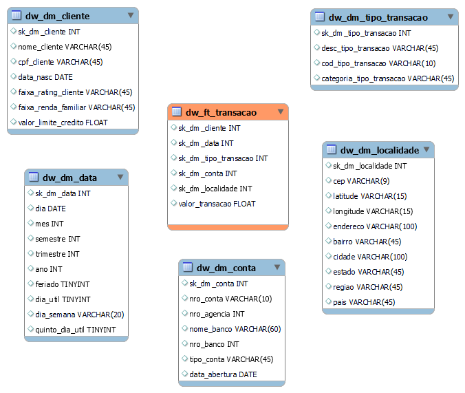
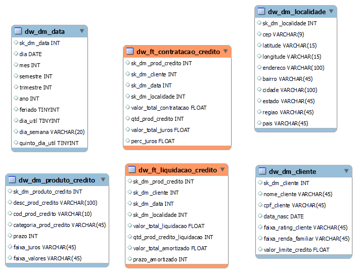
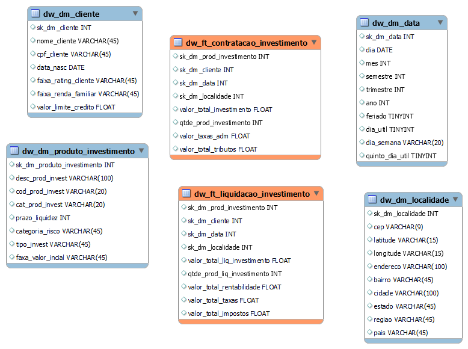
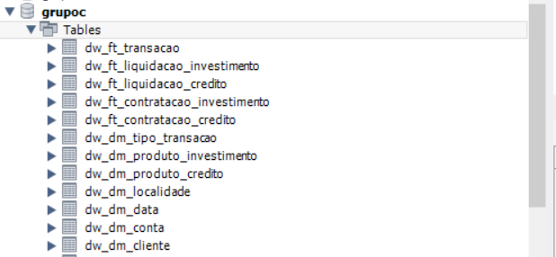

# Modelagem Dimensional

### Visão Geral

Para atender as necessidades descritas no enunciado do trabalho, criamos um modelo dimensional para tratar dos temas Transação, Venda de Produtos de Crédito e Vendas de Produtos de Investimento. 

Primeiramente discutimos e desenhamos a modelagem de forma conceitual que está documentada [neste arquivo excel](./Trabalho%2002%20-%20Modelagem%20Dimensional%20Dindin%20Agora.xlsx)

* Estamos considerando fatos separadas para Transações, Contratações de Crédito, Contratações de Investimento, Liquidações de Crédito e Liquidações de Investimentos.

* Apesar de fatos separadas, a maioria das tabelas dimensão foram consideradas para este mesmo *datamart*

* Os diagramas foram criados na ferramenta MySQL Workbench e por se tratar de um modelo dimensional, não criamos o relacionamento entre as tabelas. 

* Também criamos um arquivo SQL com o script para criação das tabelas. Este script foi executado no banco de dados disponibilizado. 

### Diagrama Transação

Abaixo o diagrama da fato Transação: 

### Diagrama Crédito

Abaixo o diagrama das fatos Crédito (Contratação e Liquidação): 

### Diagrama Investimento

Abaixo o diagrama das fatos Investimento (Contratação e Liquidação): 

### Criação das Tabelas no Banco MySQL

Criamos as tabelas no banco de dados em nuvem disponibilizado. 

O script de criação pode ser visto [aqui](./script_create_tabelas.sql) 

Também foi ajustado o [script](./script_generate_date_dimension.sql) de alimentação dos dados da tabela de dimensão de data.

As tabelas foram criadas no schema *grupoc* com o prefixo *dw_* 

