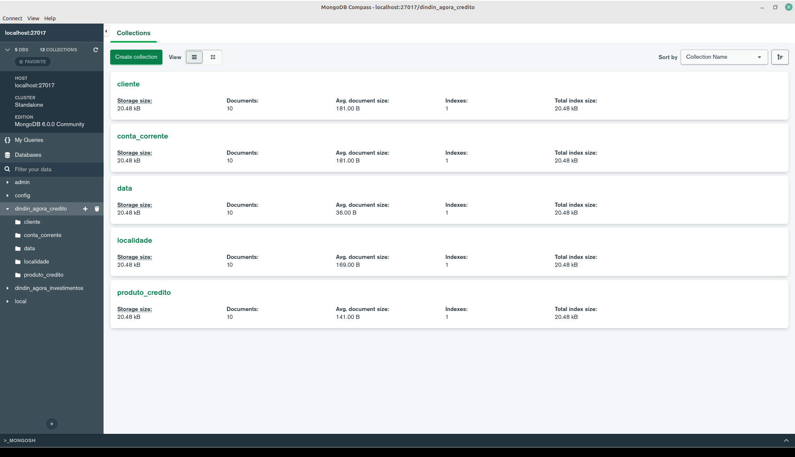
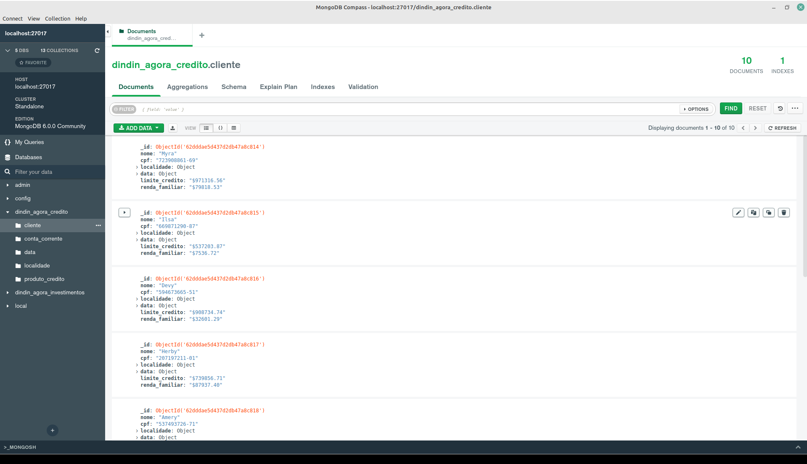
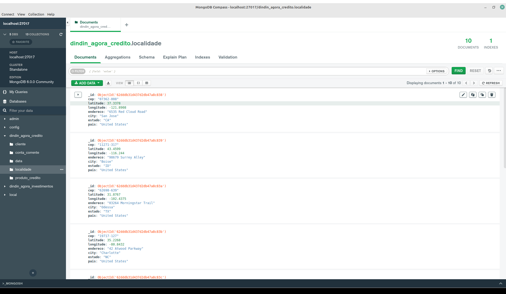
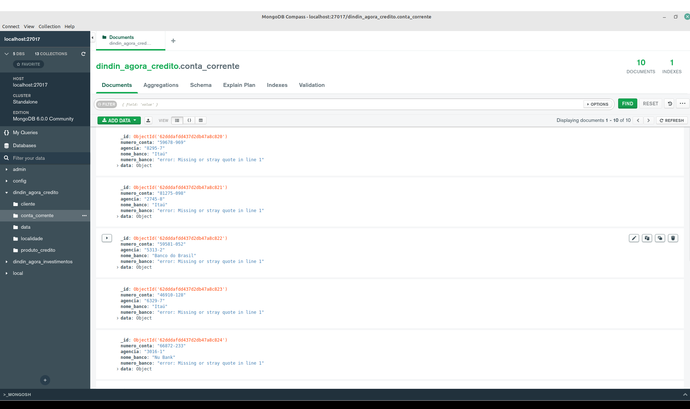
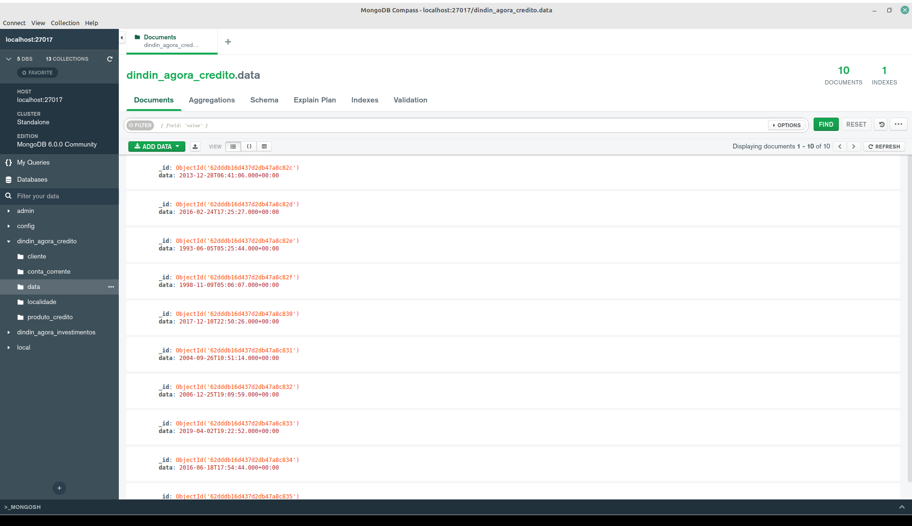
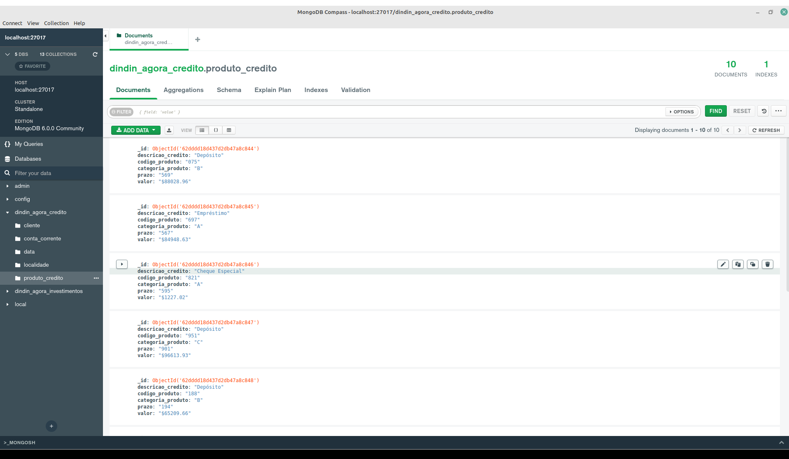

# Banco de dados NoSQL - Crédito

Optamos por criar o modelo banco de dados localmente, conforme imagens abaixo:

## Crédito collections

## Crédito Cliente Collection

## Crédito Localidade collection

## Crédito Conta Corrente collection

## Crédito Data collection

## Crédito Produtos collection

