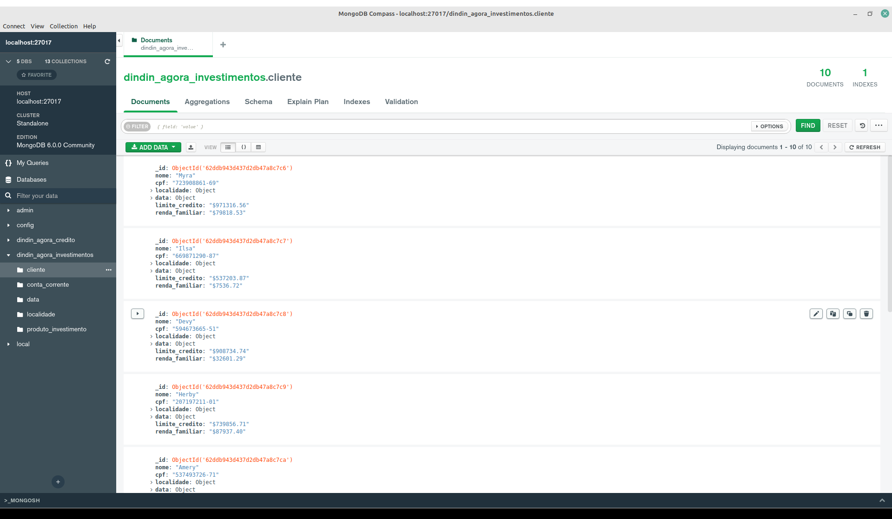

# Banco de dados NoSQL - Investimento

Optamos por criar o modelo banco de dados localmente, conforme imagens abaixo:

## Investimento collections

## Investimento Cliente Collection

## Investimento Localidade collection

## Investimento Conta Corrente collection

## Investimento Data collection

## Investimento Produtos collection

