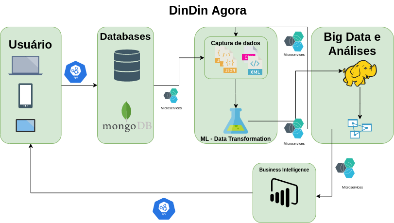

# Todas as tecnologias de dados existentes na DinDinAgora

## Entrega:
    - Desenho de diagrama da arquitetura com as tecnologias utilizadas na matéria dados relacionais de informações que não tem muita atualização não relacionais e microserviços para atualizações de informações que necessitam de agilidade, mongosql atualização de informações para processamento de big data de tempos em tempos

### Solução
    Organizamos um fluxograma com uma conexão via API comunicação com o usuário.
    Num primeiro momento suar informações que não tem uma atualização tão constante como dados cadastrais ficam armazenadas em bancos de dados relacionais.
    Suas informações que precisam de atualizações com mais frequentes, serão armazenadas em banco de dados mongodb, que também consome informações do bando de dados relacional SQL.

    As informações são processadas por machine learning e agregadas via microserviços com mais dados no hive. São feitas análises e feitas novas filtragem de informações que voltam para o processo de machine learning ou são fornecidas para o BI.

    Aquilo que pode ser de valor para o cliente é retornado via API.

